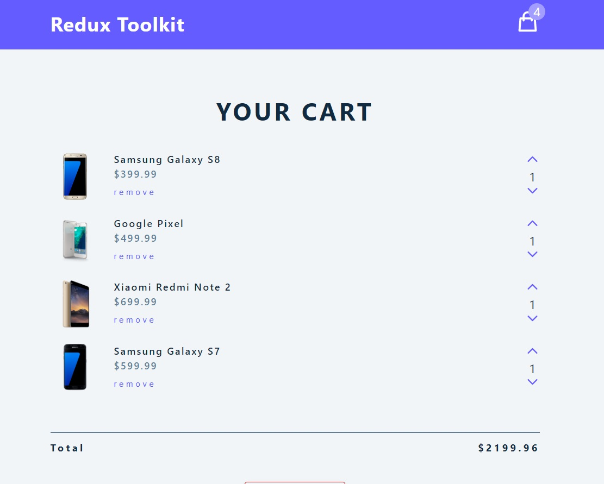
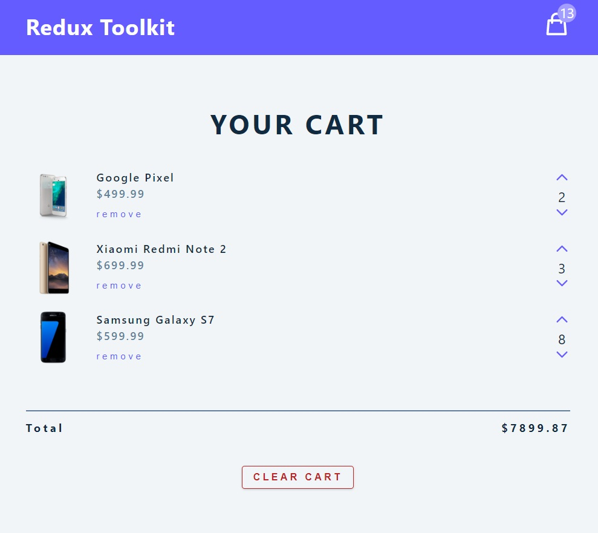
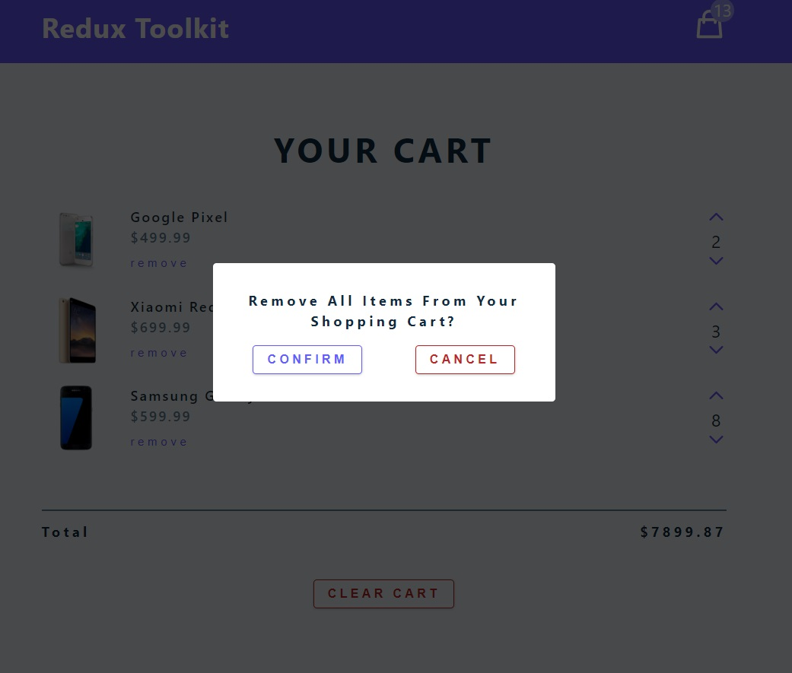
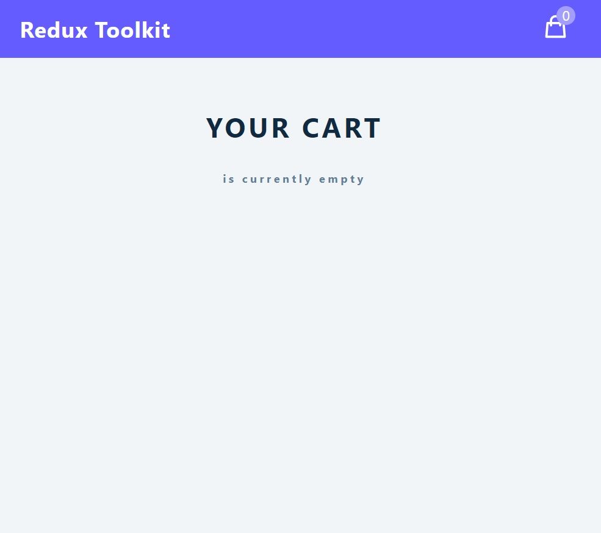

<h1 align="center"><i>Online Store Cart</i></h1>

**_
Simple online store cart. It's made in React with Redux. You can add different quantities of products and also can delete all products at once.
_**

    

    <h2 align="center">Initial render</h2>
    
    

    <h2 align="center">Add some quantities</h2>
    
    

    <h2 align="center">Delete all items</h2>
    
    

    <h2 align="center">Empty cart</h2>
    
    

<h2>Setup:</h2>
- <i><b>Download or clone the repository</b></i> 
- <i><b>To start: run npm start</b></i>

Used features of the platform:

- <i><b>Responsive Design</b></i>
- <i><b>Add unlimited quantities</b></i>
- <i><b>Reduce quantities</b></i>
- <i><b>Clear cart</b></i>

Used technologies:

- <i><b>JavaScript with React library</b></i>
- <i><b>Redux</b></i>
- <i><b>HTML</b></i>
- <i><b>CSS</b></i>

